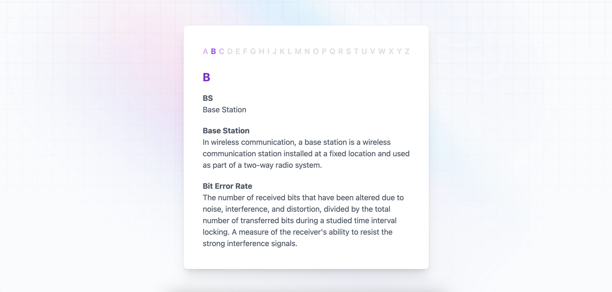
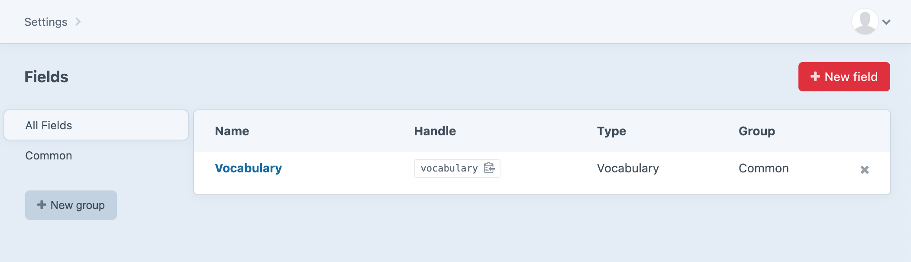
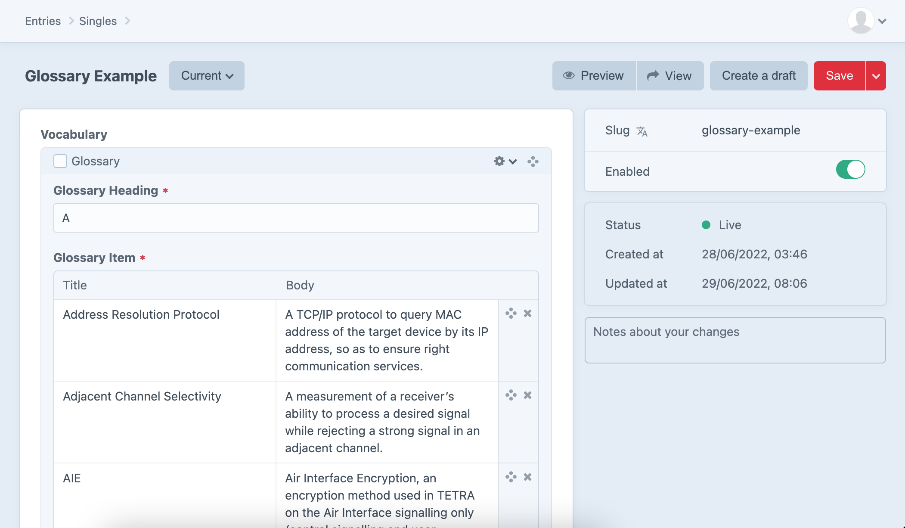

[]((https://packagist.org/packages/delaneymethod/craft-vocabulary))
[](https://packagist.org/packages/delaneymethod/craft-vocabulary)

# Vocabulary plugin for Craft CMS 3.x or later

Vocabulary is the easiest way to create and manage your own glossary of terms in Craft CMS.







## License

This plugin requires a commercial license purchasable through the [Craft Plugin Store](https://plugins.craftcms.com/plugin-sales).

## Requirements

This plugin requires [Craft CMS](https://craftcms.com/) 3.x or later.

## Installation

To install the plugin, search for “Vocabulary” in the Craft Plugin Store, or install manually using composer.

Open your terminal and go to your Craft project:

```shell
cd /path/to/project
```

Then tell Composer to load the plugin:

```shell
composer require delaneymethod/craft-vocabulary
```

In the Control Panel, go to Settings → Plugins and click the “Install” button for Vocabulary.

## Configuration

By default the plugin is already configured, creating a new `Vocabulary` Field Type and can be used like any other field.

## Examples

During installation a new Section, Entry Type, Single entry (pre-populated with some dummy data) and a Template where created to help get you started.

The Template can be found in the templates directory:

```shell
/templates/glossary-example.twig
```

and can be viewed at:

```shell
/glossary-example
```
Please feel free to delete these or rename them as you wish.

Brought to you by [DelaneyMethod](https://delaneymethod.com)
